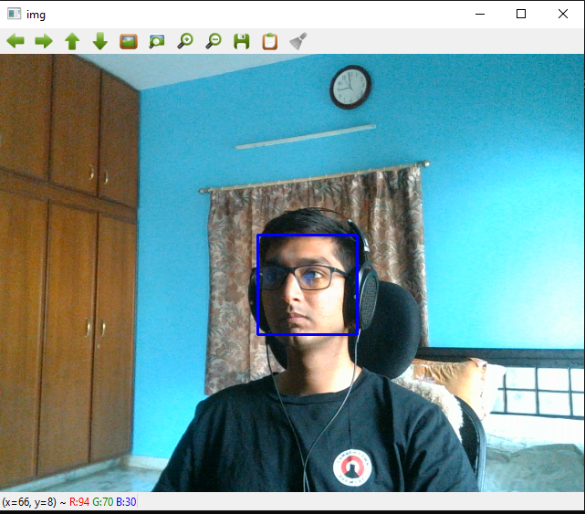

# Face Detection

I made a real time face detection using the camera, I am using opencv(Haar cascades), dlib(HOG and CNN) and MTCNN

## Haar cascades

Reference:  
https://docs.opencv.org/3.4/d1/de5/classcv_1_1CascadeClassifier.html  
https://github.com/opencv/opencv/tree/master/data/haarcascades  
https://www.bogotobogo.com/python/OpenCV_Python/python_opencv3_Image_Object_Detection_Face_Detection_Haar_Cascade_Classifiers.php 