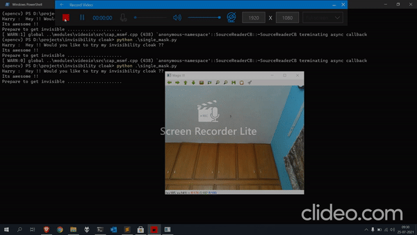

# Invisibility Cloak

I made a real time invisibility using the camera, it converts the color scheme from RGB to HSV, creates a mask based on the color range in HSV and overlays the background into the mask.

Code reference: https://github.com/spmallick/learnopencv/tree/master/InvisibilityCloak